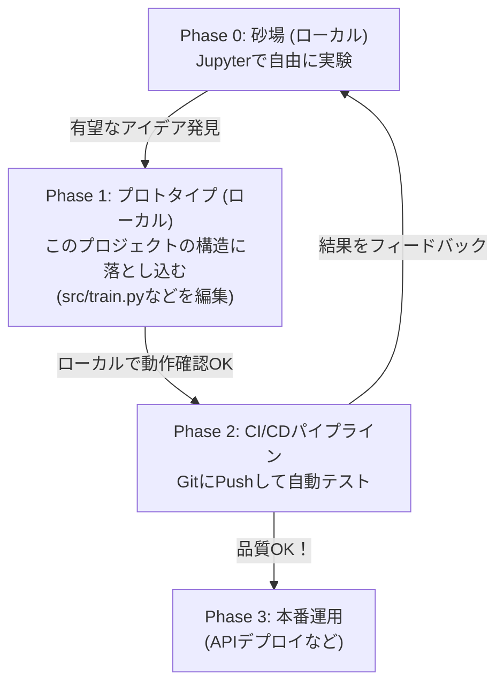

# MLOps実験プロジェクト：採用予測

最小限のMLOps構成で採用予測モデルの学習・推論を行うプロジェクトです。

## 📋 プロジェクト概要

- **タスク**: 応募者データから採用可否を予測
- **アルゴリズム**: Random Forest分類
- **構成**: Docker化された学習用・推論用環境 + GitHub Actions

## 🏗️ プロジェクト構造

```
MLOps_Exp/
├── src/                        # ソースコード
│   ├── data_generation.py      # 訓練データ生成
│   ├── train.py               # モデル学習
│   └── inference.py           # 推論実行
├── docker/                    # Docker設定
│   ├── training.Dockerfile    # 学習用
│   └── inference.Dockerfile   # 推論用
├── .github/workflows/         # CI/CD
│   └── mlops.yml             # MLOpsパイプライン
├── data/                      # データ保存
├── models/                    # モデル保存
├── docker-compose.yml         # Docker Compose設定
└── pyproject.toml            # 依存関係管理
```

## 🚀 クイックスタート

### 1. ローカル実行

```bash
uv sync
# 依存関係のインストール
uv pip install -e .

# データ生成
uv run src/data_generation.py --samples 1000

# モデル学習
uv run src/train.py

# 推論（単一）
uv run src/inference.py --mode single --age 30 --experience 5 --skill 8 --interview 7 --education 4

# 推論（バッチ）
uv run src/inference.py --mode batch --input data/hiring_data.csv --output predictions.json
```

### 2. Docker実行

```bash
# 学習と推論を一括実行
docker-compose up

# 学習のみ実行
docker-compose up training

# 推論のみ実行（学習済みモデルが必要）
docker-compose up inference

# インタラクティブに推論実行
docker-compose exec inference python src/inference.py --mode single --age 25 --experience 3 --skill 9 --interview 8 --education 5
```

## 📊 データ仕様

### 特徴量
- `age`: 年齢（22-65）
- `experience_years`: 経験年数（0-30）
- `skill_score`: スキルスコア（1-10）
- `interview_score`: 面接スコア（1-10）
- `education_level`: 学歴レベル（1-5、5が最高）

### 目的変数
- `hired`: 採用フラグ（0: 不採用, 1: 採用）

## 🔧 コマンドライン引数

### データ生成（`data_generation.py`）
```bash
uv run src/data_generation.py \
  --samples 1000 \
  --output data/hiring_data.csv \
  --seed 42
```

### モデル学習（`train.py`）
```bash
uv run src/train.py \
  --data data/hiring_data.csv \
  --model_output models/hiring_model.pkl \
  --test_size 0.2 \
  --seed 42
```

### 推論（`inference.py`）
```bash
# 単一予測
uv run src/inference.py \
  --mode single \
  --age 30 \
  --experience 5 \
  --skill 8 \
  --interview 7 \
  --education 4

# バッチ予測
uv run src/inference.py \
  --mode batch \
  --input data/hiring_data.csv \
  --output predictions.json
```

## 🔄 CI/CD パイプライン（GitHub Actions）

`.github/workflows/mlops.yml`で以下のステップが自動実行されます：

1. **学習ジョブ**
   - データ生成
   - モデル学習
   - 成果物（モデル・データ）の保存

2. **推論ジョブ**
   - 単一予測テスト
   - バッチ予測テスト
   - 結果の保存

3. **Dockerテスト**（mainブランチのみ）
   - 学習用・推論用イメージのビルド

4. **モデル検証**
   - 性能チェック（精度50%以上）
   - PRへの結果コメント

## 🎯 学習のポイント

この最小構成で以下のMLOpsコンセプトを学習できます：

### 1. **環境分離**
- 学習用と推論用のDocker環境を分離
- 依存関係の明確化

### 2. **パイプライン自動化**
- データ生成 → 学習 → 推論の自動化
- CI/CDでの品質チェック

### 3. **成果物管理**
- モデルファイルの保存・共有
- バージョン管理

### 4. **監視・検証**
- モデル性能の自動チェック
- 結果のレポート生成

## 📚 詳細ドキュメント

プロジェクトの詳細な設計・実装・学習資料は [`docs/`](docs/) フォルダにあります：

- **[設計書](docs/design.md)** - アーキテクチャと技術選択理由
- **[実装メモ](docs/implementation_notes.md)** - 実装詳細とベストプラクティス  
- **[学習ガイド](docs/learning_guide.md)** - MLOps段階的学習方法
- **[拡張アイデア](docs/expansion_ideas.md)** - 機能拡張・発展案

詳しくは [`docs/README.md`](docs/README.md) をご覧ください。

## 🛠️ 拡張アイデア

- **モデル登録**: MLflowやDVCの導入
- **API化**: FastAPIでの推論エンドポイント
- **監視**: モデルドリフト検出
- **実験管理**: ハイパーパラメータチューニング

## 📝 出力例

### 学習結果
```
=== モデル評価 ===
テストデータ精度: 0.8250

特徴量重要度:
  skill_score: 0.3247
  interview_score: 0.2831
  experience_years: 0.1456
  education_level: 0.1289
  age: 0.1177
```

### 推論結果
```
=== 予測結果 ===
採用予測: 採用
採用確率: 0.8340
不採用確率: 0.1660
```

---

**🎓 学習目的**: MLOpsの基礎概念を実践的に理解する最小構成プロジェクト


参考:

