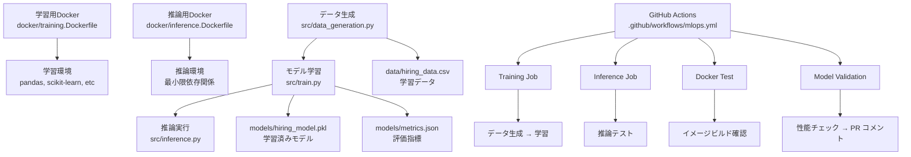

# ドキュメント

このフォルダには、MLOps実験プロジェクトの設計・実装・学習に関するドキュメントが含まれています。

## 📁 ドキュメント構成

### 🏗️ [設計書 (design.md)](design.md)
プロジェクトの設計思想、アーキテクチャ、技術選択理由をまとめた包括的な設計書

**内容**:
- プロジェクト概要と目的
- システム全体のアーキテクチャ設計
- データ・モデル・インフラの設計詳細  
- CI/CDパイプラインの構成
- 設計原則と技術選択理由

**対象**: プロジェクト全体を理解したい方、アーキテクチャを学びたい方

### 🔧 [実装メモ (implementation_notes.md)](implementation_notes.md)
実装時の技術的判断、ハマりポイント、ベストプラクティスをまとめた実装者向けメモ

**内容**:
- 各コンポーネントの実装判断理由
- Docker、CI/CD、推論システムの実装詳細
- 実装時のトラブルと解決策
- コード品質向上のためのベストプラクティス
- デバッグ・テスト戦略

**対象**: 実装を担当する方、コードを読み解きたい方

### 🎓 [学習ガイド (learning_guide.md)](learning_guide.md)
MLOpsの段階的学習方法、重要概念、チェックリストをまとめた学習者向けガイド

**内容**:
- レベル別MLOpsコンセプトの解説
- 推奨学習順序とステップ
- 重要概念の深掘り解説
- 学習評価チェックリスト
- トラブルシューティング方法

**対象**: MLOpsを学習したい方、教育担当者

### 🚀 [拡張アイデア集 (expansion_ideas.md)](expansion_ideas.md)
プロジェクトをベースにした機能拡張案、発展的な実装アイデア集

**内容**:
- Phase別の拡張機能案
- API化・マイクロサービス化
- 実験管理・監視システム
- 本格運用対応機能
- 業界別応用アイデア

**対象**: プロジェクトを発展させたい方、応用を考えたい方

## 🎯 読み方のガイド

### 初学者向け推奨順序
1. **[学習ガイド](learning_guide.md)** - 全体像の把握
2. **[設計書](design.md)** - アーキテクチャの理解
3. **実践** - 実際にコードを動かす
4. **[実装メモ](implementation_notes.md)** - 詳細理解
5. **[拡張アイデア](expansion_ideas.md)** - 発展学習

### 実装者向け推奨順序
1. **[設計書](design.md)** - 全体設計の把握
2. **[実装メモ](implementation_notes.md)** - 実装詳細の理解
3. **コード実装**
4. **[拡張アイデア](expansion_ideas.md)** - 機能拡張

### 教育者向け推奨順序
1. **[学習ガイド](learning_guide.md)** - 教育内容の把握
2. **[設計書](design.md)** - 教材の理解
3. **[実装メモ](implementation_notes.md)** - よくある質問の把握
4. **[拡張アイデア](expansion_ideas.md)** - 発展課題の準備

## 📊 MLOpsパイプライン概要図

## 🎨 ドキュメント利用方法

### 新規メンバーのオンボーディング
1. 学習ガイドで全体像を把握
2. 設計書でアーキテクチャを理解  
3. 実装メモで詳細を学習
4. 実際にコードを動かして体験

### プロジェクト拡張時
1. 拡張アイデア集で方向性を検討
2. 設計書で現在の制約を確認
3. 実装メモでベストプラクティスを参照
4. 段階的に機能を追加

### トラブル対応時
1. 実装メモのハマりポイントを確認
2. 学習ガイドのトラブルシューティングを参照
3. 設計書で仕様を再確認

## 🔄 ドキュメント更新ポリシー

### 更新タイミング
- 新機能追加時
- 設計変更時
- よくある質問の発生時
- 学習プロセスの改善時

### 更新責任
- **設計書**: アーキテクト、リードエンジニア
- **実装メモ**: 実装担当者
- **学習ガイド**: 教育担当者、メンター
- **拡張アイデア**: チーム全体

### バージョン管理
各ドキュメントの最後に更新履歴を記載し、変更内容を追跡可能にします。

---

**目的**: MLOpsの実践的理解を深め、チーム全体の技術力向上に貢献する

**メンテナンス**: プロジェクトの進化に合わせて継続的に改善 