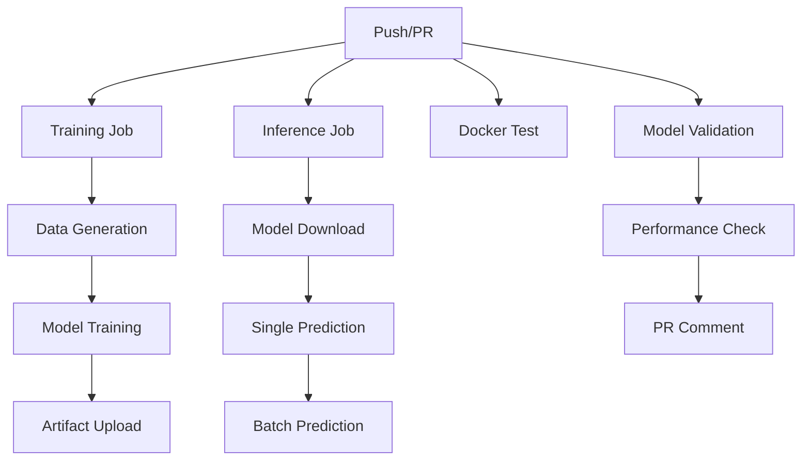

# MLOps実験プロジェクト 設計書

## 📋 プロジェクト概要

**目的**: MLOpsの基礎概念を実践的に学習できる最小限構成の実験環境を構築する

**対象**: MLOps初学者、機械学習エンジニア、データサイエンティスト

**学習タスク**: 採用データから採用可否を予測する二値分類問題

## 🏗️ アーキテクチャ設計

### 全体構成

```
MLOps Pipeline
├── Data Generation (データ生成)
├── Model Training (学習)  
├── Model Inference (推論)
├── Containerization (Docker化)
└── CI/CD (GitHub Actions)
```

### コンポーネント設計

#### 1. データ生成層 (`src/data_generation.py`)
- **責務**: 学習用データの生成
- **出力**: CSV形式の構造化データ
- **特徴**: 
  - 再現可能（random seed）
  - パラメータ調整可能
  - 統計情報の自動出力

#### 2. 学習層 (`src/train.py`)
- **責務**: モデルの学習と評価
- **入力**: CSV形式の学習データ
- **出力**: 学習済みモデル（pickle）+ 評価指標（JSON）
- **特徴**:
  - 学習・テストデータ分割
  - 特徴量重要度分析
  - 性能評価レポート

#### 3. 推論層 (`src/inference.py`)
- **責務**: 学習済みモデルでの予測実行
- **モード**: 単一予測 / バッチ予測
- **出力**: 予測結果と確率
- **特徴**:
  - モデル読み込み自動化
  - エラーハンドリング
  - 結果の可視化

## 🐳 コンテナ設計

### 学習コンテナ (`docker/training.Dockerfile`)
```
目的: データ生成 → モデル学習
ベース: python:3.9-slim
特徴: 
- 学習に必要な全ライブラリ
- ソースコード完全同期
- モデル永続化
```

### 推論コンテナ (`docker/inference.Dockerfile`)
```
目的: 軽量な推論実行環境
ベース: python:3.9-slim  
特徴:
- 最小限の依存関係
- 高速起動
- モデル読み込み最適化
```

## 🔄 CI/CD パイプライン設計

### ワークフロー構成



### ジョブ設計詳細

1. **Training Job**
   - データ生成（500サンプル）
   - モデル学習実行
   - 成果物の保存（30日間）

2. **Inference Job** 
   - モデルダウンロード
   - 予測テスト実行
   - 結果検証

3. **Docker Test**
   - イメージビルド確認
   - mainブランチのみ実行

4. **Model Validation**
   - 性能閾値チェック（50%以上）
   - PRへの結果コメント

## 📊 データ設計

### 特徴量設計
```python
Features = {
    'age': 'int (22-65)',           # 年齢
    'experience_years': 'int (0-30)', # 経験年数  
    'skill_score': 'int (1-10)',    # スキルスコア
    'interview_score': 'int (1-10)', # 面接スコア
    'education_level': 'int (1-5)'   # 学歴レベル
}

Target = {
    'hired': 'binary (0,1)'         # 採用フラグ
}
```

### 採用確率計算ロジック
```python
base_prob = 0.3
skill_boost = (skill_score - 5) * 0.05
interview_boost = (interview_score - 5) * 0.05
education_boost = (education_level - 3) * 0.03
experience_boost = min(experience_years * 0.01, 0.15)

hire_prob = clip(
    base_prob + skill_boost + interview_boost + 
    education_boost + experience_boost, 
    0.05, 0.95
)
```

## 🤖 機械学習モデル設計

### アルゴリズム選択: Random Forest
**理由**:
- 解釈しやすい（特徴量重要度）
- 過学習に強い
- 実装が簡単
- 安定した性能

### ハイパーパラメータ
```python
RandomForestClassifier(
    n_estimators=100,    # 決定木の数
    max_depth=10,        # 最大深度
    random_state=42,     # 再現性
    n_jobs=-1           # 並列処理
)
```

## 📁 ディレクトリ構造設計

```
MLOps_Exp/
├── src/                    # ソースコード
│   ├── data_generation.py  # データ生成
│   ├── train.py           # 学習スクリプト
│   └── inference.py       # 推論スクリプト
├── docker/                # Docker設定
│   ├── training.Dockerfile
│   └── inference.Dockerfile  
├── .github/workflows/     # CI/CD
│   └── mlops.yml
├── docs/                  # ドキュメント
├── data/                  # データ保存
├── models/                # モデル保存
├── docker-compose.yml     # Docker構成
├── pyproject.toml        # 依存関係
└── README.md             # 使用方法
```

## 🎯 設計原則

### 1. 最小限主義
- 学習に必要最小限の機能のみ実装
- 複雑な機能は後回し
- 理解しやすさを最優先

### 2. 再現性確保
- 全てのランダム要素にseed設定
- 環境の完全コンテナ化
- バージョン固定

### 3. 分離原則
- 学習と推論の環境分離
- データ・モデル・コードの分離
- 責務の明確化

### 4. 拡張性
- モジュール化された設計
- パラメータの外部化
- 新機能追加の容易さ

## 🔧 技術選択理由

### Python
- ML/MLOpsのデファクトスタンダード
- 豊富なライブラリエコシステム
- 学習コストが低い

### Docker
- 環境の一貫性確保
- 本番環境との差異を最小化
- デプロイメントの簡素化

### GitHub Actions
- リポジトリ統合
- 無料枠で十分
- 設定が簡単

### Random Forest
- 解釈しやすい
- ハイパーパラメータチューニング不要
- 堅牢性が高い

## 🎓 学習効果の最大化

### 段階的学習アプローチ
1. **基本実行**: ローカル環境での動作確認
2. **Docker化**: コンテナでの実行体験
3. **CI/CD**: 自動化パイプラインの理解
4. **拡張**: 追加機能の実装

### 実践的なMLOps体験
- データ → 学習 → 推論の全フロー
- 環境分離の重要性
- 自動化の価値
- 品質管理の必要性

---

**更新日**: 2024年7月
**バージョン**: v1.0
**作成者**: MLOps実験プロジェクト 